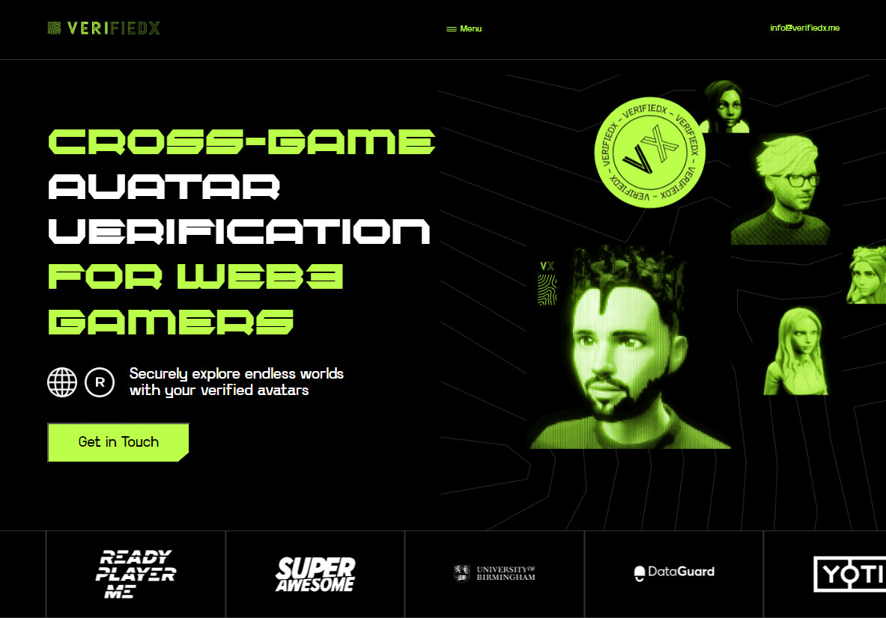

# Landing page

This is a land page for creative startup. This single page application using routing contains 2 routes.
The start page tells about the basic concept of a startup, the page about us tells a little about the team and goals.
The application has links for communication via discord, email, tiktok, linkedin and twitter

## Installation

To install the application, follow these steps:

Clone the repository to your local machine.
Open a terminal and navigate to the root directory of the project.
Run npm install to install the dependencies.
Run npm start to start the development server.
Open http://localhost:3000 in your browser.
